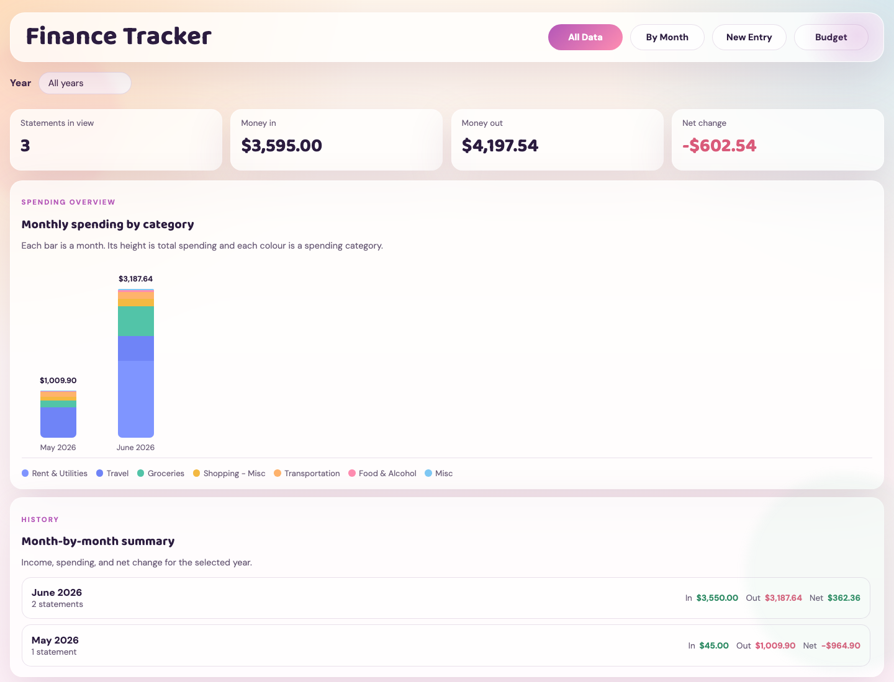

# My Personal Finance Tracker

Purely vibe coded personal finance tracker. Honestly just didnt want to have to pay a website to do this for me. 



*Dashboard shown with built-in demo data.*

## Requirements

- Python 3 with SQLite support (tested with Python 3.14).
- A modern browser with JavaScript enabled.
- Write access to the project directory so the server can save data under `storage/`.

No `pip install` or `npm install` is needed. The server uses only Python's standard library, including `sqlite3`, and the PDF.js files are bundled in `vendor/pdfjs/`, so there is no `requirements.txt`. Internet access is only needed to load the Google Fonts; the app uses fallback fonts when offline.

## Run it

From the project directory:

```bash
python3 server.py
```

Then open `http://localhost:8000`.


## What it does

- Upload one or more credit card or debit statement PDFs
- Save parsed statement data locally in your browser
- Archive original uploaded PDFs into `storage/YYYY-MM/` inside the repo
- Save structured financial data in a local SQLite database
- Save parsed monthly metadata into `storage/YYYY-MM/index.json` as a secondary archive
- Keep adding monthly statements so the dashboard tallies everything together
- Multi-select transactions and bulk-assign a category
- Extracts text in the browser with `pdf.js`
- Breaks statements into:
  - account info
  - statement period
  - opening and closing balances
  - money in and money out
  - fees
  - parsed transactions
- Draws multiple visuals:
  - money flow bars
  - category donut
  - balance trend line
  - spending timeline

## Notes

- This is tuned for text-based RBC statement PDFs, not scanned image PDFs.
- SQLite is the authoritative data store at `storage/finance.db`.
- Statement periods are normalized into separate ISO `statement_start_date` and `statement_end_date` fields; the original extracted period text is retained in the statement payload when it needed cleaning.
- Transaction descriptions, dates, categories, flow type, and numeric amounts are validated on every SQLite save. Missing source posting dates are flagged rather than guessed.
- Existing browser data is automatically migrated into SQLite the first time the updated server runs with an empty database.
- The browser retains a fallback copy, but it is no longer the authoritative data source.
- Original PDFs are archived into `storage/YYYY-MM/` based on the statement month.
- The archive server derives that folder from the normalized statement end date after it has read the PDF metadata, preventing future files from falling into `unknown-month`.
- Each month folder also gets an `index.json` file containing parsed statement summaries and transactions for future month-over-month pages.
- `storage/manifest.json` is maintained as a simple local record of archived uploads.
- The `storage/` archive is git-ignored by default, so your bank statements are not meant to be committed to a public repository.
- Before the first database change each UTC day, the server creates a consistent SQLite backup under `storage/backups/`.
- Use **Export backup** in the upload panel to download a readable JSON copy of statements, transactions, and budgets.
- Check database integrity and record counts at `http://localhost:8000/api/database/status` while the server is running.
- Back up the entire `storage/` directory to an encrypted second location. A local database and its local backups can still be lost together if the device fails.
- RBC statement layouts vary, so the parser uses heuristics and may need small adjustments for your exact debit or credit statement format.
- If a statement does not include clean transaction rows in extractable text, the summary cards may still work better than the transaction table.

## Files

- `index.html` contains the layout
- `styles.css` contains the cute responsive styling
- `app.js` is the client bootstrap: shared state, PDF parsing, storage, and cross-page interactions
- `js/pages/all-data-page.js` renders the lifetime All Data dashboard
- `js/pages/by-month-page.js` renders the selected-period summary and income check
- `server.py` serves the app and saves uploaded PDFs into the repo
